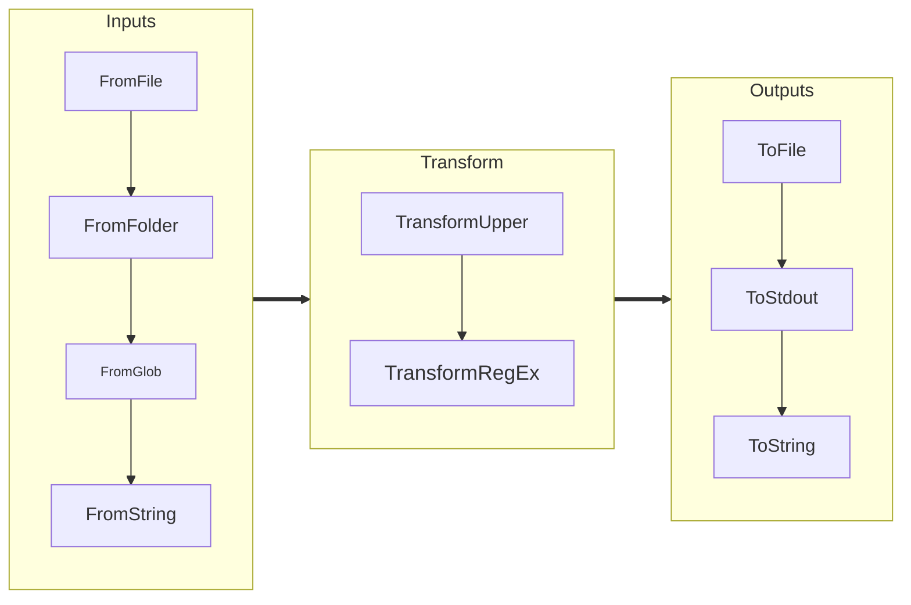

## Overview

Pipethis is an exercise in learning how to create objects that are composed using functions and general python
operator overloading mechanisms to handle constructing pipelines.  While it has 100% test coverage and is quite 
flexible it is mostly a demonstration of basic package construction using Python.

`pipethis` is a package designed to simplify the process of building, extending, and executing data pipelines.
It provides a modular framework that enables users to define pipelines as a sequence of operations and data 
transformations. Each pipeline can ingest data, process it through customizable transformations, and output 
the results in various formats. The library follows a "clean" and extensible architecture, allowing developers to
integrate predefined components or implement their own. Whether you're processing text files, building ETL pipelines, 
or experimenting with streaming data, `pipethis` streamlines the process, making it easy to assemble 
pipelines programmatically.

When I use the word "clean", my main goals were making the tool to be easy to extend by adding file handlers and
making the end user code "clean" even if this was at the expense of having the code have a few calls to
`isinstance` or having many defaults that just work.

Grossly speaking the code allows you to take input from many sources, transform it and write the aggregated data to
a number of outputs.  Obviously real world cases would likely have a single input and single output, but might have
many transforms.  My use-case was processing log files from many folders, looking for ERROR and stack traces and 
generating a report. 





Does it work?  Yeah, it has 100% coverage and 9.95/10.0 lint, so it is in decent shape.  I have used it for 
a few things, and it works, but YMMV.

### **1. Inputs**
Inputs determine how data is ingested into the pipeline. The package provides several options, including:
- `FromString`: Reads data from a Python string (largely for testing.)
- `FromFile`: Reads data from a file.
- `FromFolder`: Reads data from multiple files in a single directory.
- `FromGlob`: Reads multiple folders and calls from file for each item

The core concept if inputs is the notion of file handlers. File handlers are called on each file that is detected
in the inputs.  Files generally are treated line by line (for things like text files) and file by file for things
like images.  The handler classes stream method for standard text files is nothing more than yielding each line into
a line stream item while keeping track of line numbers (which is very important for debugging).  The package
comes by default with code for text files showing line based data and "files" for binary data showing how to 
stream images with the pillow library.

```python
 from pipethis._file_handler import FileHandlerBase
 from pipethis._streamitem import LineStreamItem
 class TextFileHandler(FileHandlerBase):
    # Class omitted
    
    def stream(self):
        """
        Stream lines from the opened file as LineStreamItems.
        """
        if not self._file:
            raise RuntimeError("The file is not open. You must use this file_handler in a context manager.")
        
        # Stream each line in the file with line number, a name and the data
        for sequence_id, line in enumerate(self._file, start=1):
            yield LineStreamItem(sequence_id=sequence_id, resource_name=(self.file_path), data=line.strip())
   ```

This same mechanism works for files that are processed all at once.

Example:
```python
from pipethis import FromString

input_component = FromString("example\ntext")
```

### **2. Transforms**
Transforms define how to process or manipulate data line by line. Examples include:
- `UpperCase`: Converts each line to uppercase.
- `AddMetaData`: Adds metadata like line numbers or source details.
- `RegexSkipFilter`: Excludes lines matching a regex pattern.

Example:
```python
from pipethis import UpperCase, RegexSkipFilter

upper = UpperCase()
filter_lines = RegexSkipFilter("skip_this")
```

### **3. Outputs**
Outputs control where the processed data is sent. Some common options are:
- `ToStdOut`: Prints to the console.
- `ToFile`: Writes output to a file.
- `ToString`: Aggregates processed data as a single string.

Example:
```python
from pipethis import ToString

output_component = ToString()
```

---

## Writing Custom Components

Extend the framework by creating custom Input, Transform, or Output components. All custom components must inherit from their respective base classes.

### Custom Input Example
```python
from pipethis import InputBase
from pipethis import LineStreamItem

class CustomInput(InputBase):
    def stream(self):
        yield LineStreamItem(1, "custom_source", "Hello, custom input!")
```

### Custom Transformation Example
```python
from pipethis import TransformBase

class ReplaceStrings(TransformBase):
    def transform(self, line):
        # Replace "old" with "new" in the content
        line.content = line.content.replace("old", "new")
        return line
```

### Custom Output Example
```python
import sys
from pipethis import OutputBase

class ToStdErr(OutputBase):
    def write(self, line):
        sys.stderr.write(line.content + "\n")
```

---

## Advanced Usage

### Pipeline Execution
Pipelines can be built incrementally and executed using the `run()` method:
```python
from pipethis import Pipeline, FromString, UpperCase, ToFile

pipeline = (Pipeline() 
           | FromString("data pipeline\nexample code")  
           | UpperCase() 
           | ToFile("output.txt"))
pipeline.run()
```

### Error Handling
Use `try/except` blocks to handle exceptions during pipeline execution:
```python
from pipethis import Pipeline, FromString, UpperCase, ToFile
try:
   pipeline = (Pipeline() 
               | FromString("data pipeline\nexample code") 
               | UpperCase() 
               | ToFile("output.txt"))
   pipeline.run()
except IOError as iox:
   print(f"Unexpected error {iox}")
```

---

## Development and Testing

To test or modify the package locally:

1. Clone the repository:
   ```bash
   git clone https://github.com/hucker/pipethis.git

   cd pipethis
   ```

2. Install in editable mode:
   ```bash
   pip install -e .
   ```

3. Run tests using `pytest`:
   ```bash
   pytest
   ```

---
## Testing

*PYTEST*

============================= 155 passed in 0.20s ==============================

*LINT*

The code uses this pylint setup:
```ini
[tool.pylint.design]
min-public-methods = 0
max-args = 6
max-positional-arguments = 6
```
And generates this lint score.

```text
------------------------------------------------------------------
Your code has been rated at 9.95/10 (previous run: 9.95/10, +0.00)
```

*TOX*

Tested on Python 3.10->3.13 (3.14 doesn't work on my M1 Mac)

```text
=============================================================================================================================================================================== 151 passed in 0.77s ===============================================================================================================================================================================
  py313: OK (2.71=setup[1.72]+cmd[0.99] seconds)
  py310: OK (2.58=setup[1.45]+cmd[1.13] seconds)
  py311: OK (2.51=setup[1.48]+cmd[1.03] seconds)
  py312: OK (7.16=setup[5.54]+cmd[1.62] seconds)
  lint: OK (1.65=setup[0.68]+cmd[0.97] seconds)
  congratulations :) (16.71 seconds)
```

*COVERAGE*

The test suite reports this coverage with sparse use of `#no cover` in _base.py in in code where
the base class will never be instantiated.

```python

from abc import ABC,abstractmethod
 
class foo(ABC):
    @abstractmethod
    def validate(self):
    """
    Perform additional subclass-specific validation.
    This method must be implemented by subclasses to add custom validation logic.
    """
    raise NotImplementedError("Subclasses must implement 'validate'") # pragma: no cover

```


```text
Name                               Stmts   Miss  Cover
------------------------------------------------------
src/pipethis/__init__.py               8      0   100%
src/pipethis/_base.py                 41      0   100%
src/pipethis/_file_handler.py         21      0   100%
src/pipethis/_image_transform.py      31      0   100%
src/pipethis/_inputs.py              152      0   100%
src/pipethis/_output.py               38      0   100%
src/pipethis/_pipeline.py             51      0   100%
src/pipethis/_streamitem.py           15      0   100%
src/pipethis/_transform.py            47      0   100%
```
---
## Contributions

Contributions are welcome! Please fork the repository, create a new branch for your changes, and submit a pull request. 
If possible, ensure all tests pass before submitting.

---

## License

This project is distributed under the MIT License. See the `LICENSE` file for full details.

---

## Questions or Feedback?

If you have questions or suggestions, please open an issue on GitHub. Contributions are welcome!