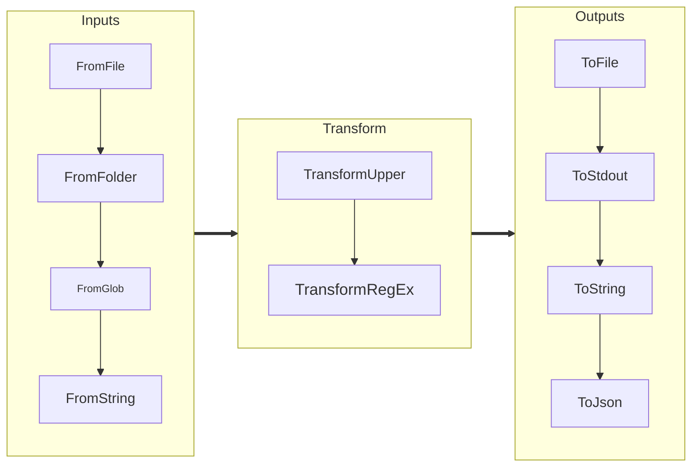

## Version Support


<br>

<!-- For now these are manually added -->


<br>


## `pipethis`: Simplify and Modularize Data Pipelines
**`pipethis`** is a Python library designed to simplify the creation, extension, and execution of data pipelines. By leveraging Python’s operator overloading and modular design, it allows developers to build readable and extendable pipelines programmatically — perfect for small to medium-sized workloads.
The library follows a clean, intuitive architecture that enables users to define pipelines as a sequence of operations, from data ingestion to transformations and output. Whether working with log files, building ETL pipelines, or experimenting with data processing workflows, `pipethis` speeds up development and results in clean, maintainable code.
### **Key Features**
- **Pipeline Composition using Function Chaining**: Build pipelines using simple, expressive Python code with operator overloading for easy chaining of transformations.
- **Modular Design**: Extend pipelines by defining custom data handlers, transformations, and outputs.
- **Rapid Development**: Focused on speeding up development for single-machine workloads, freeing you to focus on processing logic rather than boilerplate code.
- **Flexible I/O**: Supports multiple input sources, flexible transformations, and diverse output formats.
- **Customizable Defaults**: Designed to “just work,” but allows full customization where needed.

### **Limitations**
`pipethis` is optimized for single-machine, small-to-medium workloads and doesn't support multithreading or distributed computation. It works best for lightweight processing tasks.
### **Example Use Case**
Imagine needing to analyze log files from multiple folders, search for patterns (e.g., `ERROR` or stack traces), and generate a summarized report. With `pipethis`, you can rapidly compose a pipeline that:
1. Reads from multiple sources.
2. Chains transformations to filter, parse, or aggregate data.
3. Outputs a clean and actionable report.

### **A Philosophy of Clean Code**
`pipethis` prioritizes ease of use and clean end-user code, even if it involves small tradeoffs like relying on conveniences (`isinstance` checks) or opinionated defaults. Its goal is to make "clean" pipeline development accessible to developers of all experience levels.
### **Why You’ll Love (or accept it as it is) It**
`pipethis` is a straightforward yet powerful tool for:
- Rapid prototyping and experimentation with custom pipelines.
- Learning Python package design, operator overloading, and modular programming.
- Simplifying small-scale ETL workflows without requiring heavy frameworks.

### **Original Use Case**
`pipethis` was initially developed to process log files from multiple sources, extract key events or errors, and summarize them. While the focus remains on simplicity and fast prototyping, its design allows for more general-purpose data processing pipelines.





Does it work?  Yeah, it has 100% coverage and 9.95/10.0 lint, so it is in decent shape.  I have used it for 
a few things, and it works, but YMMV.

### **1. Inputs**
Inputs determine how data is ingested into the pipeline. The package provides several options, including:
- `FromString`: Reads data from a Python string (largely for testing.)
- `FromFile`: Reads data from a file.
- `FromFolder`: Reads data from multiple files in a single directory.
- `FromGlob`: Reads multiple folders and calls from file for each item

The core concept of inputs is the notion of file handlers. File handlers are called on each file that is detected
in the inputs.  Files generally are treated line by line (for things like text files) and file by file for things
like images. One could imagine that log files would be line by line, but they would find stack traces that that
take up multiple lines but "should" be handled as one thing (future feature).

The handler classes stream method for standard text files is nothing more than yielding each line into
a line stream item while keeping track of line numbers (which is very important for debugging).  The package
comes by default with code for text files showing line based data and "files" for binary data showing how to 
stream images with the pillow library.

```python
from pipethis._file_handler import FileHandlerBase
from pipethis._streamitem import LineStreamItem
class TextFileHandler(FileHandlerBase):
    # Class omitted
    
    def stream(self):
        """
        Stream lines from the opened file as LineStreamItems.
        """
        if not self._file:
            raise RuntimeError("The file is not open. You must use this file_handler in a context manager.")
        
        # Stream each line in the file with line number, a name and the data
        for sequence_id, line in enumerate(self._file, start=1):
            yield LineStreamItem(sequence_id=sequence_id, resource_name=(self.file_path), data=line.strip())
   ```

This same mechanism works for files that are processed all at once, the data item would be an image.

Example:
```python
from pipethis import FromString

input_component = FromString("example\ntext")
```

### **2. Transforms**
Transforms define how to process or manipulate data line by line. Examples include:
- `UpperCase`: Converts each line to uppercase.
- `AddMetaData`: Adds metadata like line numbers or source details.
- `RegexSkipFilter`: Excludes lines matching a regex pattern.

Example:
```python
from pipethis import UpperCase, RegexSkipFilter

upper = UpperCase()
filter_lines = RegexSkipFilter("skip_this")
```

### **3. Outputs**
Outputs control where the processed data is sent. Some common options are:
- `ToStdOut`: Prints to the console.
- `ToFile`: Writes output to a file.
- `ToString`: Aggregates processed data as a single string.
- `ToJson`: Aggregates processed data to a json file

Example:
```python
from pipethis import ToString

output_component = ToString()
```

---

## Writing Custom Components

Extend the framework by creating custom Input, Transform, or Output components. All custom components must inherit from their respective base classes.

### Custom Input Example
```python
from pipethis import InputBase
from pipethis import LineStreamItem

class CustomInput(InputBase):
    def stream(self):
        yield LineStreamItem(1, "custom_source", "Hello, custom input!")
```

### Custom Transformation Example
```python
from pipethis import TransformBase

class ReplaceStrings(TransformBase):
    def transform(self, line):
        # Replace "old" with "new" in the content
        line.content = line.content.replace("old", "new")
        return line
```

### Custom Output Example
```python
import sys
from pipethis import OutputBase

class ToStdErr(OutputBase):
    def write(self, line):
        sys.stderr.write(line.content + "\n")
```

---

## Pipeline Usage

### Pipeline Execution
Pipelines can be built incrementally by OR'ing together input, transform
and output objects.

```python
from pipethis import FromString, UpperCase, ToFile

pipeline = (FromString("data pipeline\nexample code")  
           | UpperCase() 
           | ToFile("output.txt"))
pipeline.run()
```

### Error Handling
Use `try/except` blocks to handle exceptions during pipeline execution:
```python
from pipethis import FromString, UpperCase, ToFile
try:
   pipeline = (FromString("data pipeline\nexample code") 
               | UpperCase() 
               | ToFile("output.txt"))
   pipeline.run()
except IOError as iox:
   print(f"Unexpected error {iox}")
```

#### Logging Integration

The `pipethis` package is designed to integrate seamlessly with your application's existing logging infrastructure
while also supporting its own logging.

#### Automatic Integration

Simply configure your application's logging as you normally would. All `pipethis` components will automatically use 
your logging configuration without any additional setup:

```python
import logging

# Your standard logging setup
logging.basicConfig(level=logging.INFO)

# pipethis will use your logging configuration automatically
from pipethis import FromFile
data = FromFile(filepath="example.csv")  # Logs will appear in your application's logs
```

#### Controlling Log Verbosity

If you want finer control over `pipethis` logs:

```python
import logging
# Control just the pipethis logs
logging.getLogger('pipethis').setLevel(logging.WARNING)  # Less verbose
# or
logging.getLogger('pipethis').setLevel(logging.DEBUG)    # More verbose
```

Our components log detailed initialization information at the DEBUG level, which can be useful for troubleshooting
but may be too verbose for production environments.


### More complete example
The following example takes files and folders from several locations, filters for
log file Errors

```python
from pipethis import FromFile, FromFolder, FromGlob, RegexKeepFilter, ToFile, ToStdOut, ToJson

def advanced_pipeline():
    # Define the pipeline
    pipeline = (FromFile("path/to/log_file.log")
                | FromFolder("path/to/logs_folder",keep_patterns="*.log")
                | FromGlob("path/to/more/logs",keep_patterns ="*.log")
                | RegexKeepFilter(r"ERROR")
                | RegexKeepFilter(r"database")
                | ToFile("filtered_logs.txt")
                | ToStdOut() 
                | ToJson("filtered_logs.json")
                )

    # Run the pipeline. duh
    pipeline.run()

```


---

## Development and Testing

To test or modify the package locally:

1. Clone the repository:
   ```bash
   git clone https://github.com/hucker/pipethis.git

   cd pipethis
   ```

2. Install in editable mode:
   ```bash
   pip install -e .
   ```

3. Run tests using `pytest`:
   ```bash
   pytest
   ```

---
## Testing

*PYTEST*

A test suite is provided with 100% test and source coverage using the `pytest` library. Files
ending in `test*_hy.py` indicate that property based testing is being performed using the
`hypothesis package`.  This is my first foray into property based testing.

<!-- For now these are manually added -->

============================= 155 passed in 0.20s ==============================

*LINT*

The code uses this pylint setup:
```ini
[tool.pylint.design]
min-public-methods = 0
max-args = 6
max-positional-arguments = 6
```
And generates this lint score.

<!-- For now these are manually added -->
```text
------------------------------------------------------------------
Your code has been rated at 9.84/10 (previous run: 9.82/10, +0.02)
```

*TOX*

Tested on Python 3.10->3.14

<!-- For now these are manually added -->
```text
=============================================================================================================================================================================== 151 passed in 0.77s ===============================================================================================================================================================================
  py310: OK (9.06 seconds)
  py311: OK (6.09 seconds)
  py312: OK (6.45 seconds)
  py313: OK (6.42 seconds)
  py314: OK (6.05 seconds)
  lint: OK (6.20 seconds)


```

*COVERAGE*

The test suite reports this coverage with sparse use of `#no cover` in `_base.py` for code that
the base class will never instantiate. Coverage is 100% for both the code base and the
tests.

```python

from abc import ABC,abstractmethod
 
class SomeInput(ABC):
    @abstractmethod
    def validate(self):
       """
       Perform additional subclass-specific validation.
       This method must be implemented by subclasses to add custom validation logic.
       """
       raise NotImplementedError("Subclasses must implement 'validate'") # pragma: no cover

```

To generate  the coverage results these commands should be run:
```shell
coverage run -m pytest
coverage report
```

<!-- For now these are manually added -->
```text
Name                                  Stmts   Miss  Cover
---------------------------------------------------------
src/pipethis/__init__.py                 18      0   100%
src/pipethis/_base.py                    62      0   100%
src/pipethis/_file_handler.py            24      0   100%
src/pipethis/_image_transform.py         34      0   100%
src/pipethis/_input_from_file.py         69      0   100%
src/pipethis/_input_from_folder.py       36      0   100%
src/pipethis/_input_from_glob.py         40      0   100%
src/pipethis/_input_from_string.py       16      0   100%
src/pipethis/_input_from_strings.py      20      0   100%
src/pipethis/_logging.py                 43      0   100%
src/pipethis/_output_to_file.py          23      0   100%
src/pipethis/_output_to_json.py          35      0   100%
src/pipethis/_output_to_stdout.py        14      0   100%
src/pipethis/_output_to_string.py        16      0   100%
src/pipethis/_pipeline.py                54      0   100%
src/pipethis/_streamitem.py              20      0   100%
src/pipethis/_transform.py               49      0   100%
test/test_file_handler.py                38      0   100%
test/test_from_file.py                  151      0   100%
test/test_from_file_hy.py                20      0   100%
test/test_from_folder.py                 43      0   100%
test/test_from_glob.py                   70      0   100%
test/test_from_string.py                 21      0   100%
test/test_from_string_hy.py              19      0   100%
test/test_from_strings.py                60      0   100%
test/test_image_xform.py                 76      0   100%
test/test_imagestream.py                 10      0   100%
test/test_inputs.py                      69      0   100%
test/test_lineinfo.py                    53      0   100%
test/test_logging.py                    106      0   100%
test/test_output.py                      85      0   100%
test/test_pipeline.py                   170      0   100%
test/test_strings.py                     61      0   100%
test/test_to_json.py                     70      0   100%
test/test_transform.py                   49      0   100%
---------------------------------------------------------
TOTAL                                  1744      0   100%


```
---
## Contributions

Contributions are welcome! Please fork the repository, create a new branch for your changes, and submit a pull request. 
If possible, ensure all tests pass before submitting.

---

## License

This project is distributed under the MIT License. See the `LICENSE` file for full details.

---

## Questions or Feedback?

If you have questions or suggestions, please open an issue on GitHub. Contributions are welcome!